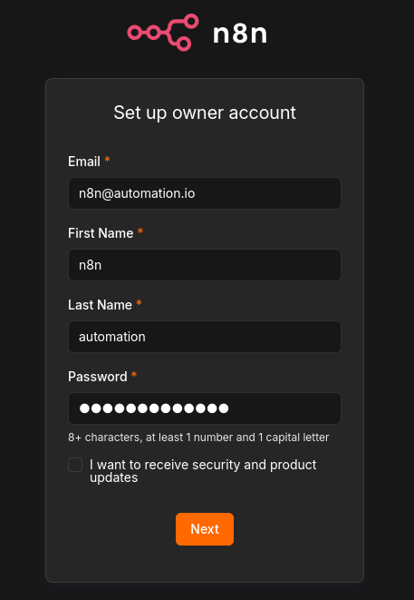
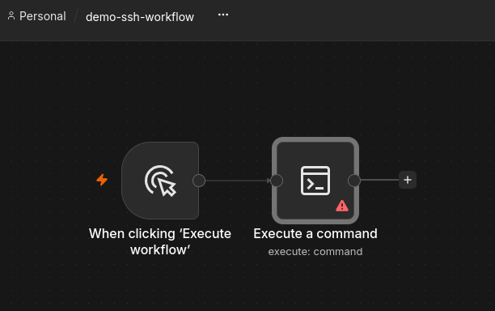
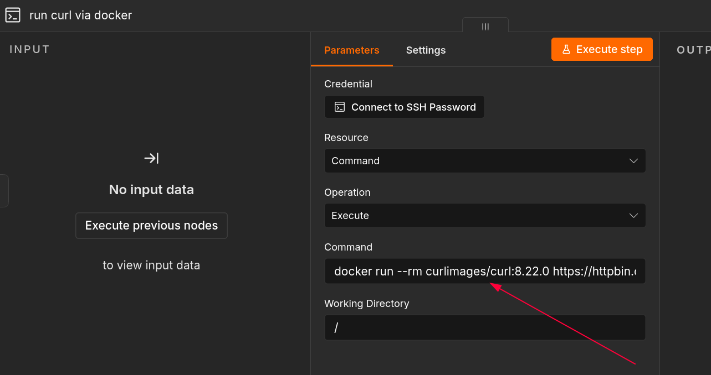
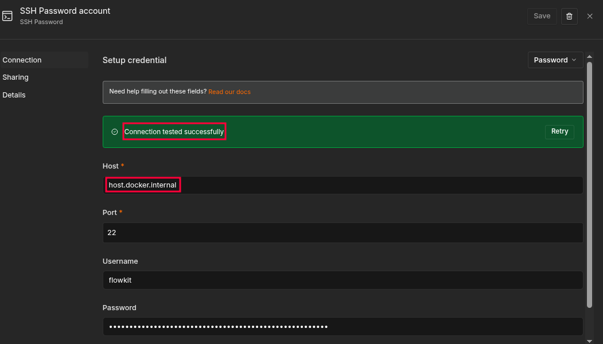
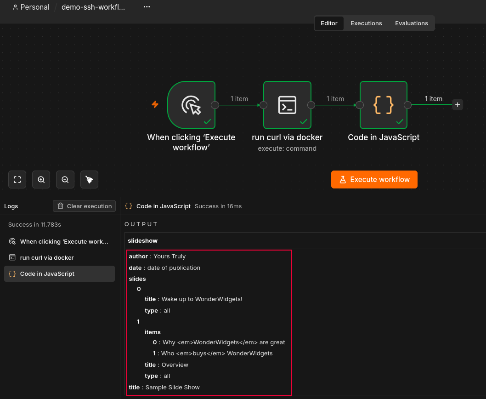
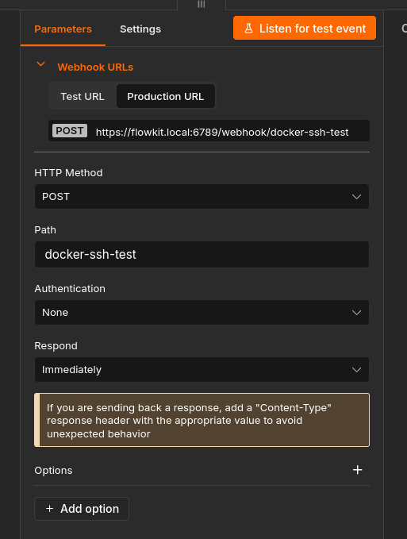
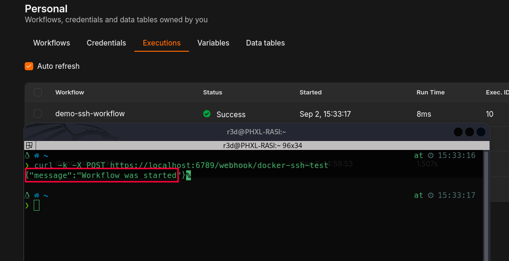

# Flowkit

[](https://unlicense.org/)
[](https://n8n.io/)  
[](https://www.docker.com/)
[](https://www.gnu.org/software/bash/)


Flowkit is a self-hosted environment for building and managing n8n automation workflows, (also) with Dockerized tools.  

It provides a portable and reproducible orchestration layer, with workflows versioned in Git for a GitOps-based development and deployment model.  
Tools remain isolated, versioned, and independently replaceable, while the platform can be extended to virtually any automation use case, including [AI-driven agentic workflows](https://docs.n8n.io/integrations/builtin/cluster-nodes/root-nodes/n8n-nodes-langchain.agent).        

Read [this article](https://www.neteye-blog.com/blog/2026/01/27/architecting-a-portable-red-team-engine/) for a concrete use case.  


## Table of Contents

- [Flowkit](#flowkit)
  - [Table of Contents](#table-of-contents)
  - [Prerequisites](#prerequisites)
  - [Instructions](#instructions)
    - [Make this repository your deployment baseline](#make-this-repository-your-deployment-baseline)
    - [First deployment](#first-deployment)
      - [TLS cert generation](#tls-cert-generation)
      - [Create SSH-enabled user](#create-ssh-enabled-user)
      - [Configure env vars](#configure-env-vars)
      - [Deploy](#deploy)
    - [Workflows](#workflows)
      - [Create your first docker-based workflow](#create-your-first-docker-based-workflow)
      - [Manage workflows](#manage-workflows)
      - [Programmatically calling workflows](#programmatically-calling-workflows)


## Prerequisites  
- Linux host (tested on arch-linux and debian-based distros)  
- Docker
- Docker Compose
- sshd  
- Python3

## Instructions  

### Make this repository your deployment baseline  
Clone or fork this repository, It will serve as the baseline for managing your n8n instance.  
For enterprise projects, I recommend copying the repository to your organization’s official internal version-control system and keeping it private.  
For personal projects, the choice is up to the individual.  
In general, I recommend keeping the repository private; however, it can also be made public if you want to share workflows with others.  
No secrets are committed to git: workflow credentials are encrypted using the `N8N_ENCRYPTION_KEY` environment variable, which is stored in the `.env` file (excluded from version control).  


### First deployment  

#### TLS cert generation  


First of all, generate a self signed TLS cert for your n8n instance:  

```bash
bash scripts/create-certs.sh
```  

> [!TIP]
> **Why self-signed TLS?**  
> Flowkit is structured to keep n8n private and off the public Internet, so a publicly trusted Let's Encrypt certificate isn't necessary.  
> If remote access is needed, I prefer [Tailscale](https://tailscale.com/) and its HTTPS certificates instead of exposing n8n publicly.

#### Create SSH-enabled user  

From the repo root create the linux user `flowkit`, **this is the user that will run n8n SSH nodes on the host**:  
```bash
sudo bash scripts/create-flowkit-user.sh
```  

> [!TIP]
> Keep track of the SSH password, you will need it in order to configure n8n credential for SSH node execution.  

#### Configure env vars  

Create the `.env` file by copying the content of `.env.example` and modify the env vars with your desired values.  

#### Deploy  

Now you are ready for the deploy, run:  
```bash
bash scripts/deploy.sh
```  

> [!TIP]
> If this is the first deployment it will take some times as it will also pull all the required docker images.   
> Subsequent deployments will be much faster.  


  
Once the deployment has completed and n8n is ready, open your browser at `https://flowkit.local:6789` and configure n8n user for UI authentication, for example:  

  


> [!TIP]
> Keep track of email and password as you will need them later to login again.  


Now try to stop the deployment and restart it:  
```bash
bash scripts/stop.sh
bash scripts/deploy.sh
```  

You should now be able to login with the user you previously created and you'll have a working n8n instance deployed  🥳  


### Workflows  

#### Create your first docker-based workflow  

In this section, we will explore how to build an automation workflow based on an SSH node.  

[SSH nodes](https://docs.n8n.io/integrations/builtin/core-nodes/n8n-nodes-base.ssh) can be particularly useful for executing commands directly on the host system.  
This enables workflows to perform tasks such as starting and managing Docker containers on the host, effectively turning n8n into an orchestration layer  
capable of integrating and controlling virtually any tool, service, or command-line operation required by the workflow.  

Create a simple workflow with a manual trigger and an SSH node, call it `demo-ssh-workflow`:    
  

Click on the SSH node and configure it, set the following as the command:  
```bash
docker run --rm curlimages/curl:8.22.0 -s https://httpbin.org/json
```  
  

> [!TIP]
> By specifying the Docker image tag, we ensure reproducibility across different machines.
> We apply this practice to both the main containers in the architecture (e.g., n8n) and the tools defined in the workflows.
  


Now click on `Connect to SSH Password` and configure authentication with the `flowkit` ssh user you created at the beginning of the deployment:  
  

Add a code node to your workflow with this javascript inside:  
```javascript
return [
  {
    json: JSON.parse($json.stdout)
  }
];
```

Now run the workflow ad observe the output:  
  
Congrats, you succesfully ran your first docker workflow! 💪  

#### Manage workflows  

One of the key advantages of using n8n via Flowkit is the ability to version workflows, enabling a **GitOps-based approach** to workflow development and deployment.  

This allows multiple team members to develop and test workflows independently on their local n8n instances, then commit and version their changes in Git for the rest of the team.  
Other members can subsequently synchronize those workflows from Git to their own test environments or deploy them to the production instance, providing a consistent and traceable workflow lifecycle.  


To support this GitOps workflow, Flowkit provides two Bash scripts for exporting and importing n8n workflows.  

`./scripts/export-workflows.sh` creates a version-controlled snapshot of the current n8n instance:  
It exports each workflow as a separate, human-readable JSON file named after the workflow, making changes easy to review and track through Git.  The script also identifies the credentials referenced by the exported workflows and stores them in `credentials/credentials.json` using n8n's built-in encrypted credential format.

`./scripts/import-workflows.sh` performs the reverse operation: It first restores the encrypted credentials and then imports the workflows from the `workflows/` directory.  
Because the original credential IDs are preserved, the imported workflows automatically retain their references to the corresponding credentials.  

This makes Git the synchronization layer between Flowkit instances: workflows can be developed locally, committed to the repository, reviewed and shared with the team, and then imported into test or production environments when required.  

> [!WARNING]
> The `N8N_ENCRYPTION_KEY` used to encrypt the credentials must be kept in `.env`, outside the Git repository and must be preserved across deployments.  
> Without the original encryption key, encrypted credentials cannot be restored.  

#### Programmatically calling workflows  

n8n can also be used as a central automation engine that exposes an API through which workflows can be triggered programmatically.  
A workflow can be made externally callable by adding a Webhook node, which exposes an HTTP endpoint that can be invoked by other applications, scripts, or automation systems.  

This effectively turns n8n into a central orchestration layer:  
external systems send a request to n8n, n8n executes the corresponding workflow, and the workflow can then orchestrate containers, tools, APIs, and other services.  


As an example of this, let's make the SSH workflow created earlier (`demo-ssh-workflow`) callable through an HTTP request.  

Open the workflow from n8n UI and add a **Webhook** node before the SSH node.  

Configure the Webhook node like this:  
  


The workflow now exposes a webhook endpoint that can be called programmatically (remember to publish the workflow in order to test this).  

When the workflow is active, n8n exposes the production webhook URL:

```text
https://flowkit.local:6789/webhook/docker-ssh-test
```  

For example, the workflow can now be triggered from the command line:

```bash
curl -k -X POST https://flowkit.local:6789/webhook/docker-ssh-test
```  

  


> [!NOTE]
> The `-k` option is required in this example because Flowkit uses a self-signed TLS certificate. If the certificate is trusted by the client, `-k` is not required.


