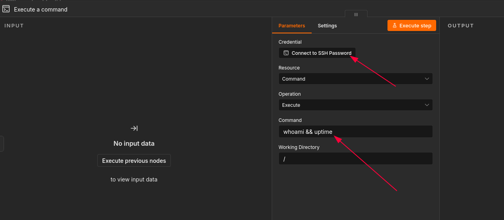
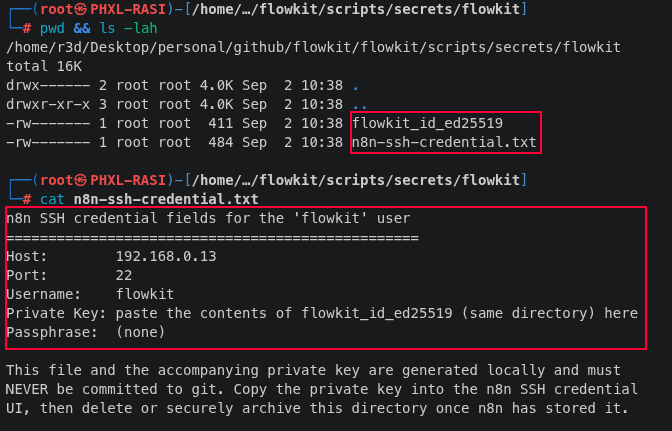
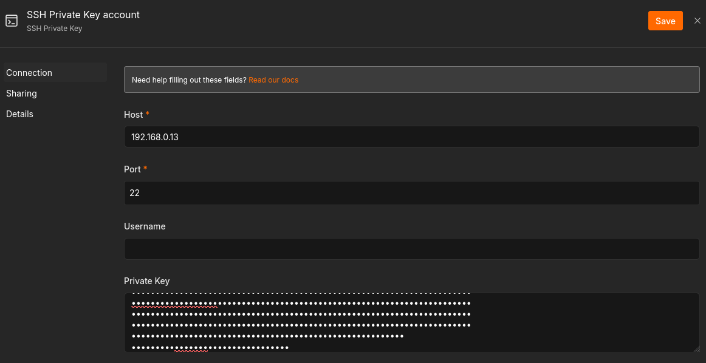

# Flowkit


Flowkit is a version-controlled toolkit for a self-hosted, local n8n automation stack, including Docker Compose, workflows, commands, and Bash scripts.  
It provides a single, reproducible home for building and managing n8n automations.  


## Prerequisites  
- Linux host (tested on arch-linux and debian-based distros)  
- Docker
- Docker Compose
- sshd  


## Instructions  

### Fist deployment (from scratch):  


First of all, generate a self signed TLS cert for your n8n istance:  

```bash
mkdir certs && cd certs && openssl req -x509 -nodes -days 825 \
  -newkey ec -pkeyopt ec_paramgen_curve:prime256v1 \
  -keyout flowkit.key -out flowkit.crt \
  -subj "/CN=flowkit.local" \
  -addext "subjectAltName=DNS:flowkit.local,DNS:localhost,IP:<your-LAN-IP>"
```  

Now, from the repo root create the linux user `flowkit`, **this is the user that will run n8n SSH node on the host**:  
```bash
sudo bash scripts/create-flowkit-user.sh
```  


Now create the `.env` file by copying the content of `.env.example` and modify the env vars with your desired values.  

Now you are ready for the deploy, run:  
```bash
bash scripts/deploy.sh
```  
If this is the first deployment it will also pull all the required docker images.  
Once the deployment has completed and n8n is ready, open your browser at `https://localhost:6789` and configure n8n user for UI authentication, for example:  

  

Keep track of email and password as you will need them later to login again.  
Now try to stop the deployment and restart it:  
```bash
bash scripts/stop.sh
bash scripts/deploy.sh
```  

If everything went well, you should be able to login with the user you previously created.  

Now is time to build your first automation!  
We will start the ssh user we create at the beginning, add an SSH node to your workflow and confire ssh key auth:  
  

For the SSH password, follow `./scripts/secrets/flowkit/n8n-ssh-credential.txt` and configure the node from the UI:  
  
  


```bash
./scripts/deploy.sh
./scripts/stop.sh          # stop only
./scripts/stop.sh --down   # stop + remove containers
```  

